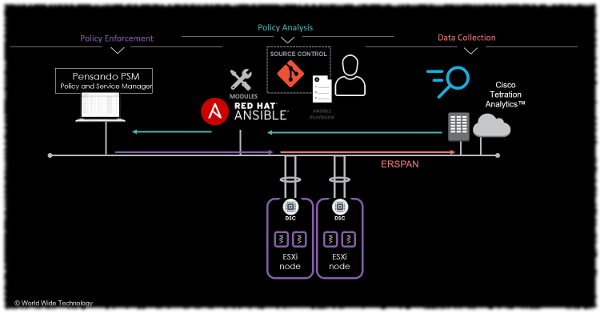

# Ansible Collection - wwt.pensando (joelwking.pensando)

The Pensando PSM (Policy Services Manager) platform is a policy and services manager based on a programmable, secure microservice-based infrastructure, providing policy management and infrastructure functions.

The objective of this project is to use Ansible modules to programmatically manage (query, delete, create, update) then Network Security Policy configuration on the Policy Services Manager controller.

The security policy can be generated from any analytics engine, configuration file or policy database. 

One use case is to retrieve policy from Cisco Tetration using either the API or the network policy publisher. Refer to the https://github.com/joelwking/ansible-tetration repository.

## Initial Use case
Organizations have implemented Cisco Tetration for its machine learning and analysis of network traffic patterns within on-premise data centers. By installing software agents on servers, meta-data on the network traffic between servers can be streamed to the Tetration appliance and analyzed. Optionally, the enforcement agent can be installed to instrument the host-based firewall to implement a zero-trust policy for East-West traffic within a data center.

The policy applied to servers by the Tetration enforcement agent is also available by subscribing to the Network Policy Publisher
or using APIs (Application Programming Interfaces). The sample playbooks use [`tetration_application`](https://github.com/joelwking/ansible-tetration/blob/master/library/tetration_application.py) to retrieve policy from Tetration via the API.

### Limiting Factors
Many organizations, however, are reluctant to install agents on hosts for data collection and enforcement. Installing agents adds another level of configuration management complexity. Enforcing policy at the server level may add complexity to troubleshooting connectivity issues.

Additionally, applying policy on network devices for complex rule sets may exhaust ternary content-addressable memory (TCAM).  TCAM is a specialized piece of memory in hardware where access-lists (ACLs) are stored. The TCAM size limits the number rules (access-lists).

### Data Collection and Policy Enforcement at the Compute Edge
One solution to address these limiting factors is to offload the flow capture and policy enforcement to the compute edge. The advantage is two-fold, elimination of agents on hosts, and enforce policy at scale.

The Pensando Distributed Services Card (DSC) is a PCIe card which is capable of enabling ERSPAN (bi-directional) terminating on a Tetration ERSPAN sensor. The sensor generates telemetry to Tetration  based on the SPANed traffic.

The DSC is also capable of implementing 1M IPV4/IPv6 stateless ACL entries from policy propagated by the Policy & Services Manager (PSM).

### Agentless Flow Data
The sample Ansible modules and playbooks in this repository, and using the prior work of [ansible-tetration](https://github.com/joelwking/ansible-tetration), enable retrieving policy from Tetration and enabling that policy as Apps and Network Security Policy on the PSM.

#### Topology Diagram


Once the policy is enabled on the PSM, it is propagated to the associated Distributed Services Cards (DSC). 

## Playbooks
These playbooks are for testing, documentation and demonstration purposes. They illustrate adding, deleting and updating the network security policy and deleting and adding apps, and referencing apps in network security policy.

You may use them for reference and customize and modify as your work flow and business requirements dictate.

* `playbooks/workflow_use_case.yml` this playbook was created to demonstrate a sample work flow. The playbook optionally retrieves policy from Tetration based on the application name and version. It writes the policy to disk as pretty-printed JSON for review. It re-formats the policy for loading into the PSM. It queries the name of the existing network security policy and fails if no policy exists on PSM. It adds an App using the policy. The name of the App is based on the application name, version, and a timestamp, creating a unique App on the PSM. It references the `files/environments.yml` configuration file to determine network addressing associated with this application name. Finally, it appends the existing network security policy referencing the app, and the source and destination addresses specified in the environment file.
* `tests/basic_functions.yml` is used for testing and examples of basic functionality.
* `playbooks/tetration_policy_source.yml` uses [`tetration_application`](https://github.com/joelwking/ansible-tetration/blob/master/library/tetration_application.py) to retrieve policy from the Cisco Tetration API, manipulates the data, and then calls `plugins/modules/network_security_policy.py` to apply policy to the PSM. It does not manipulate apps, only network security policy.
* `playbooks/tetration_app.yml` also uses `tetration_application` to retrieve policy and create apps on the PSM. One feature of this playbook, the version of the ADM run which generated the policy can be specified, and the playbook can create apps based on the application name and version. This enables having multiple versions in the PSM. This playbook illustrates deleting and adding apps and network security policy.

## Modules
These modules use the PSM API to query, delete and create/update the associated objects.

* `plugins/modules/network_security_policy.py`  manages network security policies.
* `plugins/modules/app.py` manages apps.
* `plugins/module_utils/Pensando.py` contains Python class(s) called by modules to handle common functions.

Module documentation is accessible by using `ansible-doc` and specify the collection namespace,

```shell
$ ansible-doc joelwking.pensando.network_security_policy
```
or viewing the Python source code.

## Issues
Open issues and caveats listed in this section.
      
* *App names*: App names cannot include colons, e.g. `'app_name="TetlabBase:WordPress"'` is not valid. In Tetration, the app name can include a colon. 

## Author
Joel W. King  @joelwking
