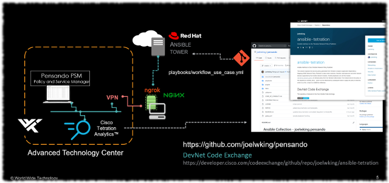

## Demonstration Environment
The demonstration environment used an AWS EC2 instance running Ansible tower to update apps and policy on a PSM running in the World Wide Technology Advanced Technology Center (ATC). 

### Diagram


### Ansible Tower
To execute the code and playbooks on Ansible Tower, version 3.6.4 with Ansible 2.9.7. 

#### /etc/ansible/ansible.cfg
The base configuration file was modified to specify the collection and module locations:
```
$ ansible-config dump --only-changed
COLLECTIONS_PATHS(/etc/ansible/ansible.cfg) = [u'/usr/share/ansible/collections']
DEFAULT_MODULE_PATH(/etc/ansible/ansible.cfg) = [u'/usr/share/ansible/plugins/modules', u'/usr/share/ansible']
DEFAULT_STDOUT_CALLBACK(/etc/ansible/ansible.cfg) = yaml
DEPRECATION_WARNINGS(/etc/ansible/ansible.cfg) = False

```
Install `tetration_application.py` in `/usr/share/ansible`. 
```bash
sudo curl https://raw.githubusercontent.com/joelwking/ansible-tetration/master/library/tetration_application.py -o tetration_a
pplication.py
```
Clone the collection into `/usr/share/ansible/collections/ansible_collections/joelwking
` - make the directories and `cd` to the file path, then clone.

```bash
sudo git clone https://github.com/joelwking/pensando.git
```
You will need to create a project and job template in Ansible Tower to execute the sample playbooks. for `playbooks/workflow_use_case.yml` these extra vars can be specified in a survey.

```yaml
app_environment: dev
app_name: PolicyPubApp
app_version: latest
pensando_psm:
  host: d1fde99cd0bc.ngrok.io
  password: '{{ psm_password }}'
  username: admin
psm_password: $encrypted$
```

### NGROK
We are using a combination of NGROK and NGINX on the same host, to temporarily enable inbound access from the cloud hosted Ansible Tower to the PSM behind the corporate firewall(s).

### Auth Token
Your NGROK account auth token is stored under your account home directory. Refer to https://dashboard.ngrok.com/auth/your-authtoken 

```bash
$ ls  ~/.ngrok2/*
/home/administrator/.ngrok2/ngrok.yml
```

### Running
To execute and stay connected, assuming your external IP address is 10.0.2.15 (which may be the case for a VM running in VirtualBox- the NAT Interface)

```bash
./ngrok http 10.0.2.15:80
```
Execute and run in the background:
```bash
./ngrok http 10.0.2.15:80 > /dev/null &
```
You can determine the tunnel addressing by running:
```bash
curl http://127.0.0.1:4040/api/tunnels | python -m json.tool
```

### NGINX
Follow the installation instructions for your Linux distribution, here is a link for installing NGINX on Ubuntu, https://ubuntu.com/tutorials/install-and-configure-nginx#1-overview.

#### Installation
Install on APT based systems.

```bash
sudo apt update
sudo apt install nginx
```

#### Modify the configuration file
The following are two examples of the `/etc/nginx/sites-enabled/default` configuration file. 

##### Single Interface System
When running on a single interface system (**olive-iron.sandbox.wwtatc.local**) this configuration file can be used.

```
#
server {
        listen 80 default_server;
        listen [::]:80 default_server;
        location / {
          proxy_bind $server_addr;
          proxy_pass https://pensando-venice.sandbox.wwtatc.local/;
          proxy_set_header Upgrade $http_upgrade;
          proxy_set_header Connection "upgrade";
        }

}
```
##### Multi Homed System
When running on a host running in Virtual Box on a laptop, you typically will have a default NAT interface and a Host-only interface. Specify the IP address of the NAT interface. Substitute your NAT interface IP address for `10.0.2.15`.
```
##
#
server {
        listen 80 default_server;
        listen [::]:80 default_server;
        location / {
          proxy_bind 10.0.2.15;
          proxy_pass https://pensando-venice.sandbox.wwtatc.local/;
          proxy_set_header Upgrade $http_upgrade;
          proxy_set_header Connection "upgrade";
        }
}
```

In either of the two example configuration files, substitute your target host in the `proxy_pass` directive.

#### Restarting NGINX
After configuration changes, you will restart the service.
```bash
sudo systemctl restart nginx
```
If errors are encountered in the configuration file, you will be instructed on the location of logs indicating more specifics on the issue.

## Author
Joel W. King joel.king@wwt.com @joelwking
